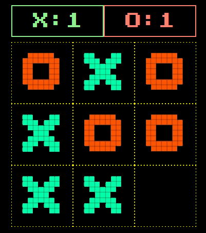

# Tic tac toe : html5 + css + js (Demo)

## [english]
The tic-tac-toe game made entirely with html5, css and javascript.

## [italian]
Il gioco tic-tac-toe realizzata interamente con html5, css e javascript.

[Tic tac toe DEMO](https://marcellopagano.github.io/tic-tac-toe/)

## Features

- map array
- score
- win match
- draw match
- control of assigned block
- sound
- restart game
